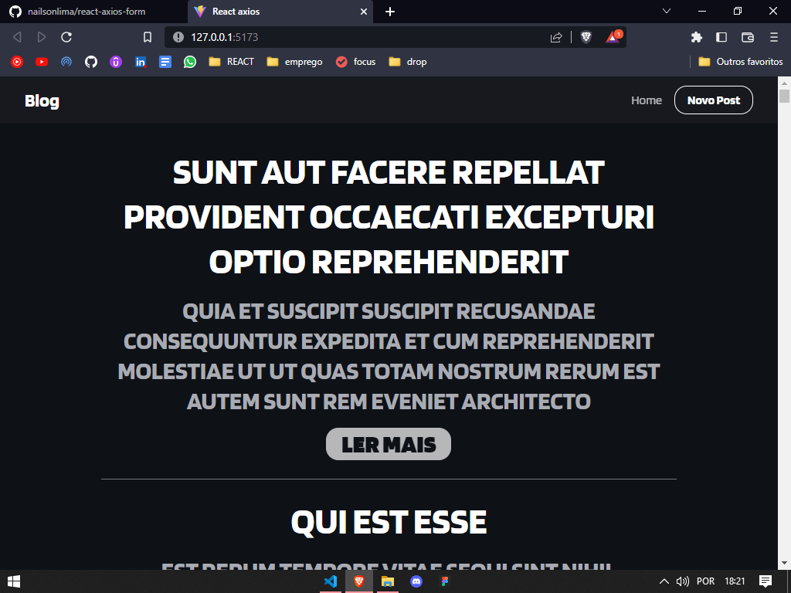
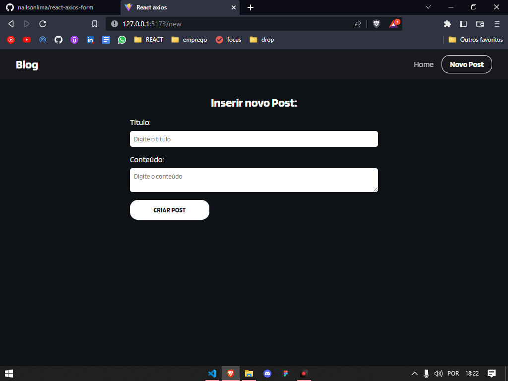
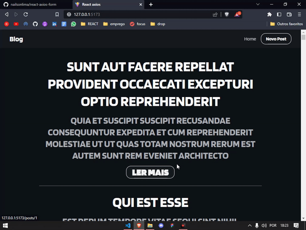

# REACT AXIOS FORM
🤘🏻Projeto feito com apoio de video aula:  
https://www.youtube.com/watch?v=NbhoeLj6lBs

<h2>🔴Aqui temos a página inicial do projeto, design simples e intuitivo!</h2>
<h2>OBS: O design tem várias mudandas implemenadas por mim em relação ao projeto inicial.</h2>

<h2>🔴A seguir temos a página para adição de novos posts no servidor, tudo feito inteiramente com react axios, excluindo assim o fetch api.</h2>

G I F

Esse foi o projeto, Thank you!😍👌

